# Parallel Build

[](https://github.com/glhd/parallel-build/actions/workflows/ci.yml)

`parallel.sh` runs chains of commands at the same time, stops everything at
the first failure, and prints each chain's output in one block instead of
interleaved. It is POSIX sh, one file, and nothing else, so it runs in a
build container as it is.

Before, where `npm` waits on `composer` for no reason:

```sh
#!/bin/sh
set -e
composer install --no-dev --no-interaction --prefer-dist --optimize-autoloader
npm ci --audit false
npm run build
```

After:

```sh
#!/bin/sh
set -e
. ./parallel.sh

chain "composer install --no-dev --no-interaction --prefer-dist --optimize-autoloader"
chain "npm ci --audit false" "npm run build"

run
```

Drawn out, with the times off a middling Laravel app. The second one
finishes when its longest chain does rather than when its last command
does:

```mermaid
gantt
    title The build above, in order and in chains
    dateFormat HH:mm:ss
    axisFormat %M:%S
    todayMarker off
    section In order
    composer install :done, 00:00:00, 00:00:40
    npm ci           :done, 00:00:40, 00:01:30
    npm run build    :done, 00:01:30, 00:01:50
    section In chains
    composer install :active, 00:00:00, 00:00:40
    npm ci           :active, 00:00:00, 00:00:50
    npm run build    :active, 00:00:50, 00:01:10
```



A failure arrives sooner for the same reason. The step that fails is not
waiting on the steps that would have run before it, so the build stops
about when the failure happens instead of once everything ahead of it is
done:

```mermaid
gantt
    title A lint that fails, at the end of a script and in a chain
    dateFormat HH:mm:ss
    axisFormat %M:%S
    todayMarker off
    section In order
    phpunit            :done, 00:00:00, 00:00:50
    lint, exits 1      :crit, 00:00:50, 00:01:00
    section In chains
    phpunit, cancelled :active, 00:00:00, 00:00:10
    lint, exits 1      :crit, 00:00:00, 00:00:10
```



When something fails, the failure is at the bottom and the rest is grouped
above it:

```
--- composer install
Installing dependencies
Generating autoload files

[!] npm build
added 214 packages
building for production...
[!] npm build exited 1

... assets
[.] assets cancelled
```

## Install

It is one file. Vendor it:

```sh
curl -fsSLO https://raw.githubusercontent.com/glhd/parallel-build/main/parallel.sh
```

or fetch it in the build itself:

```sh
curl -fsSL https://raw.githubusercontent.com/glhd/parallel-build/main/parallel.sh -o /tmp/parallel.sh
. /tmp/parallel.sh
```

## API

`chain <label> <command> [command...]` declares a chain. Its commands run in
order, each one only if the one before it succeeded, and the chain stops at
the first failure. Each command is a string, evaluated by the shell, so
pipes, redirects and `&&` work inside one.

`run` waits for every chain, prints their output in the order they were
declared, and returns the exit code of the chain that failed, or 0. The
first failure cancels the chains still running. Because `run` returns that
code, it can be the last line of a build script:

```sh
run
```

Nothing else is public. `chain` and `run` are meant to be called once each,
in that order.

## POLL

`run` polls for finished chains, by default every `0.1` seconds. Fractional
sleeps are not in POSIX, and a `sleep` that rejects them is detected on the
first poll, after which polling falls back to whole seconds. Set `POLL` for
a different interval and `POLL_WHOLE` for a different fallback:

```sh
POLL=0.5 . ./parallel.sh
```

## Benchmarks

`bench/bench.sh` runs four builds twice each, once in declaration order the
way a `set -e` script runs them and once as chains. Every step in them is a
`sleep`, at a tenth of the length the step it stands for would take, so the
suite is minutes rather than hours. On a four-core Linux box, under dash,
best of three runs:

| Scenario | In order | In chains | Speedup |
| --- | ---: | ---: | ---: |
| PHP app with a front end | 11.01s | 7.09s | 1.6x |
| CI checks, four of them | 12.01s | 5.03s | 2.4x |
| A failing lint | 6.01s | 1.03s | 5.8x |
| One dominant step | 10.01s | 6.04s | 1.7x |

- **PHP app with a front end** — `composer install` (4s) in one chain,
  `npm ci` (5s) then `npm run build` (2s) in the other. The build at the top
  of this file.
- **CI checks, four of them** — lint (1s), typecheck (3s), unit tests (5s)
  and a build (3s), none of them waiting on any other. The shape chains are
  best at: the job takes as long as its slowest check instead of as long as
  all of them.
- **A failing lint** — unit tests (5s) alongside a lint that exits 1 after
  1s. In order the failure turns up last because that is where the step is,
  and a lint at the top of the script would be found just as early. That is
  the point: in chains it does not matter where it is.
- **One dominant step** — `npm run build` (6s) alongside `composer install`
  (3s) and `php artisan migrate` (1s). The ceiling on all of this: a build
  cannot finish before its longest chain does, so the most chains can do is
  hide the rest behind it.

Eight chains that do nothing at all finish in 0.15s: one `mktemp`, eight
forks, and a poll or two. That is about what the library costs a build with
nothing to gain.

The table is a report on shapes, not a measurement of any real build. A
`sleep` waits without competing for a core, a disk or a link, so these are
the times a build gets when its steps are mostly waiting on something other
than each other. Steps that each saturate the machine will not see them.

`make bench` runs it. `REPS` is how many runs each scenario gets, `SCALE`
multiplies every duration, and `SHELL_UNDER_TEST` picks the shell:

```sh
REPS=1 SCALE=0.25 SHELL_UNDER_TEST=/bin/bash make bench
```

CI runs it on every push and puts the table in the run summary. It fails the
job only when a scenario was not faster in chains than in order at all:
anything tighter is a number to hold against a hosted runner, and they are
too noisy to be held to one.

## Caveats

`kill` stops a cancelled chain's shell, not its grandchildren. A command
that spawned its own children can leave one behind that outlives the chain
it belonged to. In a build container that exits anyway this does not matter;
in a long-lived shell it will.

Fractional `sleep` is not in POSIX, though both GNU coreutils and BSD accept
it. Whole seconds are the fallback, not the default, so a build on a shell
without fractional sleep finishes up to a second later than it might.

Under zsh, a script with `set -e` whose `run` fails leaves the temp
directory behind: zsh skips `EXIT` traps when errexit is triggered by a
function returning non-zero. Every other shell, and every other exit path
under zsh, removes it.

The library has no `local`, because POSIX sh has none. It keeps its own
state in names starting with `_`, but its loops use `i`, `n`, `cmd`, `code`,
`label` and `mark`, and sourcing it will clobber those in the calling
script.

## Prior art

- `make -j --output-sync=target` — parallelism and grouped output, if the build is already a Makefile.
- GNU `parallel --halt now,fail=1 --group` — the same idea with far more of everything, and a dependency.
- [mise](https://mise.jdx.dev) — task runner with parallel tasks and dependencies, for projects that have adopted it.
- [concurrently](https://github.com/open-cli-tools/concurrently) — the npm equivalent, if Node is a given.
