# Parallel Build

[](https://github.com/glhd/parallel-build/actions/workflows/ci.yml)

`parallel.sh` runs chains of commands at the same time, stops everything at
the first failure, and labels every line it prints with the chain it came
from, as that chain writes it. It is POSIX sh, one file, and nothing else,
so it runs in a build container as it is.

Before, where `npm` waits on `composer` for no reason:

```sh
#!/bin/sh
set -e
composer install --no-dev --no-interaction --prefer-dist --optimize-autoloader
npm ci --audit false
npm run build
```

After:

```sh
#!/bin/sh
set -e
. ./parallel.sh

chain "composer install" \
	"composer install --no-dev --no-interaction --prefer-dist --optimize-autoloader"
chain "npm build" "npm ci --audit false" "npm run build"

run
```

The first argument is what the chain is called; the rest are what it runs.

Drawn out, with the times off a middling Laravel app. The second one
finishes when its longest chain does rather than when its last command
does:

```mermaid
gantt
    title The build above, in order and in chains
    dateFormat HH:mm:ss
    axisFormat %M:%S
    todayMarker off
    section In order
    composer install :done, 00:00:00, 00:00:40
    npm ci           :done, 00:00:40, 00:01:30
    npm run build    :done, 00:01:30, 00:01:50
    section In chains
    composer install :active, 00:00:00, 00:00:40
    npm ci           :active, 00:00:00, 00:00:50
    npm run build    :active, 00:00:50, 00:01:10
```



A failure arrives sooner for the same reason. The step that fails is not
waiting on the steps that would have run before it, so the build stops
about when the failure happens instead of once everything ahead of it is
done:

```mermaid
gantt
    title A lint that fails, at the end of a script and in a chain
    dateFormat HH:mm:ss
    axisFormat %M:%S
    todayMarker off
    section In order
    phpunit            :done, 00:00:00, 00:00:50
    lint, exits 1      :crit, 00:00:50, 00:01:00
    section In chains
    phpunit, cancelled :active, 00:00:00, 00:00:10
    lint, exits 1      :crit, 00:00:00, 00:00:10
```



Every line says which chain wrote it, and the labels are right aligned so
the bars line up. A build that works prints its output and stops there; when
one fails, the last word is what failed and what was cancelled with it:

```
composer install │ Installing dependencies
       npm build │ added 214 packages
composer install │ Generating optimized autoload files
       npm build │ building for production...
       npm build │ ERR! Build failed in 4.21s

[!] npm build exited 1
[.] composer install cancelled
```

In a terminal each label is in a colour of its own, one a chain, and
everywhere else the output is the plain text above; [`COLOR`](#color) is the
whole of it.

A line is printed once it is whole, so a command that writes a line in two
writes still gets one line, and the chain it belongs to is the only thing
that decides where it goes. `STREAM=0` holds the output and groups it
instead, which is [below](#stream).

## Install

It is one file. Vendor it:

```sh
curl -fsSLO https://raw.githubusercontent.com/glhd/parallel-build/main/parallel.sh
```

or fetch it in the build itself:

```sh
curl -fsSL https://raw.githubusercontent.com/glhd/parallel-build/main/parallel.sh -o /tmp/parallel.sh
. /tmp/parallel.sh
```

## API

`chain <label> <command> [command...]` declares a chain. Its commands run in
order, each one only if the one before it succeeded, and the chain stops at
the first failure. Each command is a string, evaluated by the shell, so
pipes, redirects and `&&` work inside one.

`run` waits for every chain, prints what they write under the label of the
chain that wrote it, ends by naming the chain that failed and the chains
cancelled with it, and returns the exit code of the chain that failed, or 0.
The first failure cancels the chains still running. Because `run` returns
that code, it can be the last line of a build script:

```sh
run
```

Nothing else is public. `chain` may be called as often as a build has chains
to declare, and `run` once, after them.

A chain that did not simply work ends on one of three lines, and both layouts
use the same ones, so a build that greps for one finds it either way:

- `[!] npm build exited 1` — the chain failed, and this is the code it failed
  with.
- `[.] npm build cancelled` — it was still running when another chain failed.
- `[!] npm build killed` — it was taken away before it could report: the
  signal nothing can catch, or the machine running out of memory. `run`
  returns 137 for it, which is what a shell reports for a child SIGKILL took.

Some smaller things worth knowing:

- A chain reads its input from `/dev/null`, so nothing it runs can take what
  the build script was going to read.
- `chain` with no label at all writes to stderr and returns 2, which stops a
  `set -e` build where it stands.
- The library takes the `EXIT`, `INT` and `TERM` traps for itself, which is
  how it takes the chains down with it and clears up after them. A build with
  traps of its own should set them before sourcing, and expect them to be
  replaced.
- Every name it defines starts with an underscore, apart from `chain`, `run`
  and the settings below. Nothing else in the calling script or in a chain's
  commands is touched.

## POLL

`run` polls for finished chains, by default every `0.1` seconds. Fractional
sleeps are not in POSIX, and a `sleep` that rejects them is detected on the
first poll, after which polling falls back to whole seconds. Set `POLL` for
a different interval and `POLL_WHOLE` for a different fallback:

```sh
POLL=0.5
. ./parallel.sh
```

Set it before sourcing rather than in front of the `.`, which is a special
built-in: an assignment in front of one persists in a POSIX shell and does
not in bash or zsh, so `POLL=0.5 . ./parallel.sh` is two different things
depending on where it runs. The environment works everywhere too, so
`POLL=0.5 ./build.sh` on a script that sources the library is the other way
to do it.

## GRACE

A cancelled chain is asked to stop and then waited for, so that it is gone
before the process group it leads is taken down and there is nobody left to
announce the killing. `GRACE` is how many polls it gets before the signal
nothing can ignore, a hundred of them by default, which at the default `POLL`
is about ten seconds:

```sh
GRACE=300
. ./parallel.sh
```

Without a bound, a build step that ignores `SIGTERM` would hold `run` open
with no way out but Ctrl-C.

## STREAM

Output is labelled and printed as it arrives. `STREAM=0` holds each chain's
output instead and prints it in one block a chain, in declaration order,
with the failure at the bottom — nothing is printed until a chain has
finished, and nothing a chain wrote is anywhere but under its own heading:

```sh
STREAM=0 ./build.sh
```

```
--- composer install
Installing dependencies
Generating optimized autoload files

[!] npm build
added 214 packages
building for production...
[!] npm build exited 1
```

`STREAM_SEP` is the bar between a label and its line. It defaults to `│`
where the locale says the terminal is UTF-8, and to `|` where it does not:

```sh
STREAM_SEP='|' ./build.sh
```

Labelled output is read on the same poll that watches for finished chains,
so a line can be up to `POLL` behind the command that wrote it.

## COLOR

Each chain's label is given a colour of its own, so which chain a line came
from reads without reading the label at all. The colour opens before the
label and closes after the bar, in both layouts, so the bars make a column in
the chain's colour and what a command wrote goes out exactly as it wrote it.
The `[!]` and `[.]` in front of an outcome line stay plain: the colour says
which chain, and nothing else.

Colour is on where `run` prints to a terminal that says it has colours, and
off everywhere else, so a build that pipes its output to a file or greps it
for `[!]` gets the same plain text it got before. Four things have a say, and
each one overrules the one before it:

- **the terminal** — colour where stdout is one and terminfo reports eight
  colours or more. `TERM` unset or `dumb` counts as none, and where there is
  no `tput` to ask, a `TERM` that is set and is not `dumb` is taken at its
  word.
- **`NO_COLOR`** — set to anything at all, no colour. The convention the rest
  of the build already follows.
- **`FORCE_COLOR`** — set to anything but `0`, colour; set to `0`, none.
  `FORCE_COLOR=0` is how a good many tools are told to stop, so it is read as
  a refusal rather than as the name being set.
- **`COLOR`** — `1` for colour, `0` for none, `auto` to leave it to the three
  above. It is last because it is the only one of the four aimed at this
  library:

```sh
COLOR=1 ./build.sh | tee build.log
```

`COLOR_PALETTE` is the colours themselves, a space separated list of SGR
parameters, handed out in declaration order and started again from the top once a build has more chains
than the palette has colours. It defaults to cyan, magenta, green, yellow and
blue: the colours a terminal has had since it had eight of them, less red,
which belongs to what a build says about its own failures, and less black and
white, which the rest of the line already is.

```sh
COLOR_PALETTE='1;36 1;35 1;32' ./build.sh
```

An entry is whatever SGR takes, so `1;36` is bold cyan and `38;5;213` is one
of the 256 a terminal that has them will answer to. Emptying the palette is
another way of asking for no colour at all; leaving it unset is what gets the
default.

## Benchmarks

`bench/bench.sh` runs four builds twice each, once in declaration order the
way a `set -e` script runs them and once as chains. Every step in them is a
`sleep`, at a tenth of the length the step it stands for would take, so the
suite is minutes rather than hours. On a four-core Linux box, under dash,
best of three runs:

| Scenario | In order | In chains | Speedup |
| --- | ---: | ---: | ---: |
| PHP app with a front end | 11.01s | 7.09s | 1.6x |
| CI checks, four of them | 12.01s | 5.03s | 2.4x |
| A failing lint | 6.01s | 1.03s | 5.8x |
| One dominant step | 10.01s | 6.04s | 1.7x |

- **PHP app with a front end** — `composer install` (4s) in one chain,
  `npm ci` (5s) then `npm run build` (2s) in the other. The build at the top
  of this file.
- **CI checks, four of them** — lint (1s), typecheck (3s), unit tests (5s)
  and a build (3s), none of them waiting on any other. The shape chains are
  best at: the job takes as long as its slowest check instead of as long as
  all of them.
- **A failing lint** — unit tests (5s) alongside a lint that exits 1 after
  1s. In order the failure turns up last because that is where the step is,
  and a lint at the top of the script would be found just as early. That is
  the point: in chains it does not matter where it is.
- **One dominant step** — `npm run build` (6s) alongside `composer install`
  (3s) and `php artisan migrate` (1s). The ceiling on all of this: a build
  cannot finish before its longest chain does, so the most chains can do is
  hide the rest behind it.

Eight chains that do nothing at all finish in 0.15s: one `mktemp`, one job
control probe, eight forks, and a poll or two. That is about what the library costs a build with
nothing to gain.

The table is a report on shapes, not a measurement of any real build. A
`sleep` waits without competing for a core, a disk or a link, so these are
the times a build gets when its steps are mostly waiting on something other
than each other. Steps that each saturate the machine will not see them.

`make bench` runs it. `REPS` is how many runs each scenario gets, `SCALE`
multiplies every duration, and `SHELL_UNDER_TEST` picks the shell:

```sh
REPS=1 SCALE=0.25 SHELL_UNDER_TEST=/bin/bash make bench
```

CI runs it on every push and puts the table in the run summary. It fails the
job only when a scenario was not faster in chains than in order at all:
anything tighter is a number to hold against a hosted runner, and they are
too noisy to be held to one.

## Caveats

Cancelling a chain kills its process group where the shell can give a chain
one of its own, which takes down what the chain started however deep it
goes. Job control is what puts a chain in a group, and a non-interactive
shell is not obliged to have any, so the library starts one job under
`set -m` at the first `chain` and asks whether that job got a group to
itself. bash, ksh93 and mksh give it one, and zsh does when it has a
terminal. dash and busybox ash accept `set -m` and start the job in the
shell's own group regardless, and there cancelling still kills the chain's
shell and not its grandchildren: a command that spawned its own children can
leave one behind that outlives the chain it belonged to. In a build
container that exits anyway this does not matter; in a long-lived shell it
will.

Fractional `sleep` is not in POSIX, though both GNU coreutils and BSD accept
it. Whole seconds are the fallback, not the default, so a build on a shell
without fractional sleep finishes up to a second later than it might.

The file itself is ASCII, comments included, and the two characters in it
that are not, the box drawing bar and the escape a colour begins with, are
written as their bytes in the places they are needed. A shell reads a script
through the locale, and a strict one in the C locale refuses a file carrying
a byte sequence that locale cannot make a character of, which is the locale a
build container has when nobody has set one. `make lint` checks it.

Under zsh, a script with `set -e` whose `run` fails leaves the temp
directory behind: zsh skips `EXIT` traps when errexit is triggered by a
function returning non-zero. Every other shell, and every other exit path
under zsh, removes it.

The library has no `local`, because POSIX sh has none. Every name it uses
starts with an underscore instead, including its loop counters, so a calling
script and a chain's commands can use whatever they like as long as it does
not start with one.

A chain that something else kills is announced by bash as well as by the
report: bash prints a line about the job to stderr when it reaps one that a
signal ended, and there is no asking it not to. No other shell here says
anything, and it only happens when a chain is taken from outside, which is
worth a line either way.

## Shells

The suite runs under every shell below, on every push. The library is written
for what they have in common, which is POSIX and not much more:

| Where | Shells |
| --- | --- |
| Linux | dash, bash, bash `--posix`, ksh93, mksh, zsh, zsh `--emulate sh`, posh, busybox ash |
| macOS | `/bin/sh` (bash 3.2), bash, zsh |
| FreeBSD | `/bin/sh` |

posh is Debian's policy-compliant shell, which is POSIX and deliberately
nothing else; it is the one that objected to `"$@"` with no arguments behind
it. bash in POSIX mode and zsh emulating sh are there because that is what
`/bin/sh` is on a good many machines, and both differ from their own default
mode in ways this library can feel. yash is not in the list: it is stricter
still, and the library does run under it, but shellspec cannot drive it here.

## Prior art

- `make -j --output-sync=target` — parallelism and grouped output, if the build is already a Makefile.
- GNU `parallel --halt now,fail=1 --group` — the same idea with far more of everything, and a dependency.
- [mise](https://mise.jdx.dev) — task runner with parallel tasks and dependencies, for projects that have adopted it.
- [concurrently](https://github.com/open-cli-tools/concurrently) — the npm equivalent, if Node is a given.
